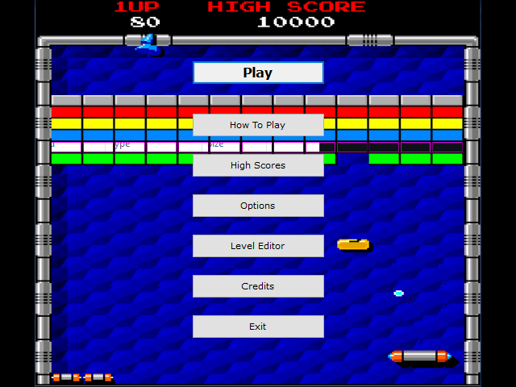
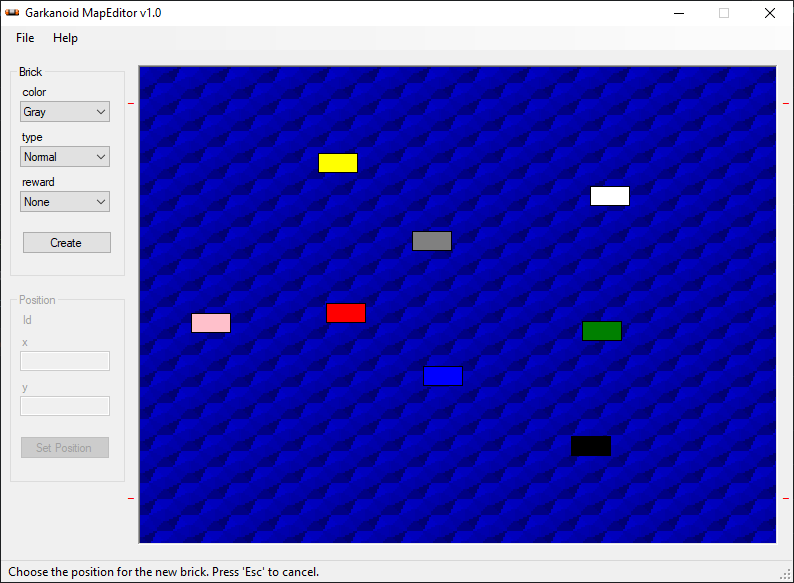
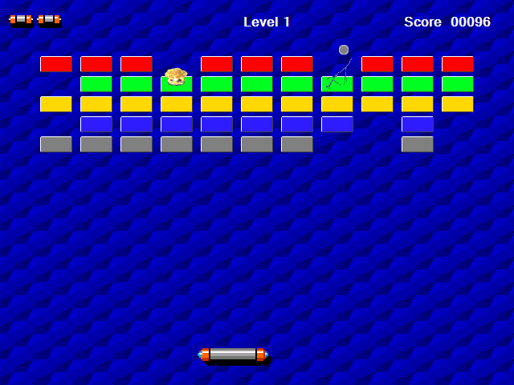
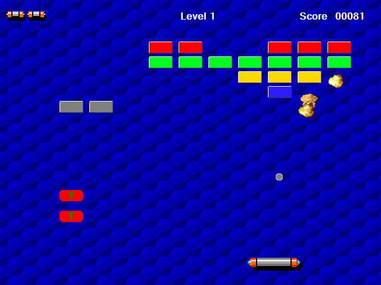

# gArkanoid v1.1

An 'Arkanoid' (NES) game clon, developed in C# & GDI+

&nbsp;

### Screenshots

| Welcome Screen                           | Map Editor                               |
|------------------------------------------|------------------------------------------|
|     |  |

| Game                                     |  Game                                    |
|------------------------------------------|------------------------------------------|
|     |     |

&nbsp;

### Version History

v1.0 (2021.05.12) - Initial release.  

&nbsp;

This is the first public release of this project.  
Developed in 2010.02 for subject 'Sistemas de Procesamiento de Datos', at Universidad Tecnológica Nacional (UTN), Buenos Aires, Argentina.  
Enjoy!  

This source code is licensed under GPL v3.0  
Please send to me your feedback about this game: andres.garcia.alves@gmail.com
